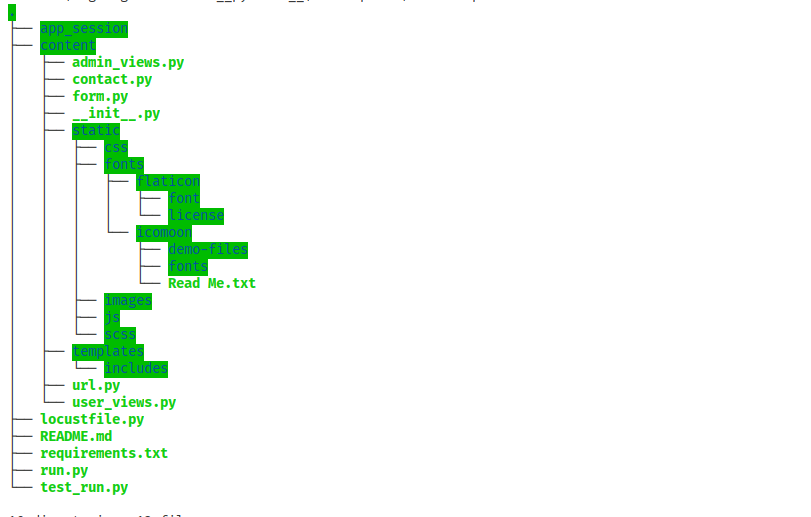

# ICEBLOG
*A blog website that elaborates on topics about lifestyle, health, entertainment, tech and sports.*

## Installation
* First you have to get [Python](https://www.python.org) installed on your computer.
* Create a new directory
* Open the directory in a terminal, then enter the command `git init .`
* Enter the command `git clone https://github.com/iSOLveIT/eveblog.git` in the terminal

* Install all dependencies in the requirements.txt file by using command `pip install -r requirements.txt` or Installation info 2

## How to run the app
#### Using the Flask WSGI_server
* In order to run the app, open the directory in a terminal, then enter the command `python3 run.py` 

#### Using the Gunicorn_server
* To run the app, open the directory in a terminal, then enter the command `gunicorn -w 4 -b "localhost:5000" run:app`

* NOTE: 
    * If you intend using this project in the productive environment do not use the development server.
    * Make sure debug=True is excluded in a productive environment

## How to test the app
#### Using pytest for testing authentication system and pages
* To perform unit testing, I used a python testing framework called pytest.
* The test code can be found in test_run.py

#### Using locust.io for load testing
* To perform load testings, I used the [locust.io](https://locust.io/) testing tool
* The test code can be found in locustfile.py

## What does the app achieve?
* The app informs readers about health tips, living a good life, etc.
* Readers are able to subscribe to weekly blog posts and can give comments about a blog.
* Readers can contact the team through the contact form which sends an email straight into the teams inbox. 
* The app has an authentication system for the blog writers. 
* The writers have a nice and simple admin interface that indicates the number of blog a writer has and manages the adding, editing and deleting of blog. 

## How the app was designed to achieve that?
* The app was designed with the Python web framework called Flask.
* The app was designed as a package to make the code maintainable. 
* The app implemented the Django MVC architecture in Flask by having a different files for holding the views (user_views.py and admin_views.py) and routes (routes.py in Django known as url.py) 

## Main Pages
* Home
* Blogs
* About
* Contact
* Sign In
* Dashboard
* Profile
* Create User
* Comments

## Directory Structure

## Preview Link
[IceBlog](https://iceblog-gh.herokuapp.com/)

## Author
* __Duodu Randy :octocat:__

### Date Created
* _Sunday, 12th April, 2020_
